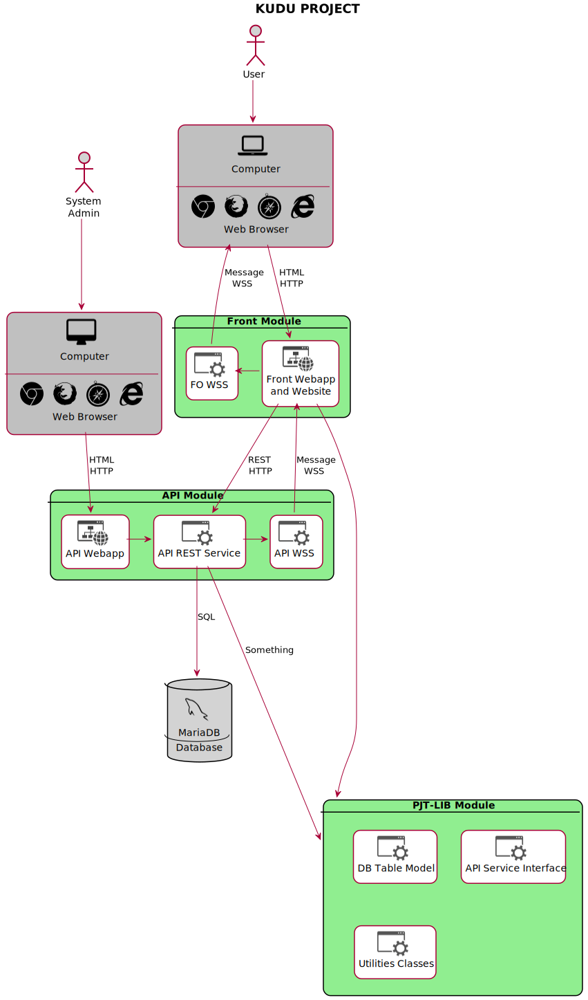

# Kudu Application

>   KUDU = กู do = กูทำเอง (when search for Kudu in google will be found the Horned Animal, that's it = มีเขาหล่อ = กูหล่อไง ทำเองใช้เอง^^)


### TECHNOLOGY LIST

| Name                                        | File / Version                                 | Description                                                  |
| ------------------------------------------- | ---------------------------------------------- | ------------------------------------------------------------ |
| Web Server                                  | Jboss Wildfly 18.0.1                           | required by the TechTeam (C-Level Servers)                   |
| JDK                                         | JDK 11<br />(tested on JDK 13 is working well) | deal with LocalDate.ofInstant by K.Thammasak                 |
| Java EE                                     | Java EE8                                       | in runtime, this is provided by Wildfly<br />in devtime, this is the library named 'javax-lib' |
| Spring Security                             | Spring Framework:<br />Spring Security v5.2.1  | SessionRegistry                                              |
| Primefaces                                  | Primefaces 7.0                                 | bundled with<br />+ jQuery v3.3.1<br />+ jQuery UI v1.12.1   |
| Deprecated: Unused ~~jQuery Newer Version~~ | ~~jquery-3.4.1.slim.min.js~~                   | read this : https://stackoverflow.com/questions/25508564/how-to-solve-a-conflict-with-primefaces-jquery<br /><br /><br />already tested to replace jquery by this newer version (/resources/primefaces/jquery/jquery.js) it will make primefaces actions can't operate.<br />already tested to remove this newer version to see what's happen in timesheet, but still work as well. |
| Bootstrap CSS                               | Bootstrap v3.3.7                               | [need to check for where to use this css library]            |


### JAVA LIBRARY LIST

>   This project has 3 modules with 3 packed files, it's need to build and pack in this sequence.
>
>   1.  PJT-LIB : pjt-lib.jar
>   2.  API : api.war
>   3.  FRONT END : front.war

| Parent Folder / Group | Description                                                  | PJT-LIB                 | API                     | FRONT                   | pjt-lib.jar | api.war                 | front.war               |
| --------------------- | ------------------------------------------------------------ | ----------------------- | ----------------------- | ----------------------- | ----------- | ----------------------- | ----------------------- |
| api-lib               | from Handover api.war                                        | :ballot_box_with_check: | :ballot_box_with_check: |                         |             | :ballot_box_with_check: |                         |
| common-lib            | from Handover api.war<br />(pjt-lib.jar need to put in this group) | :ballot_box_with_check: | :ballot_box_with_check: | :ballot_box_with_check: |             | :ballot_box_with_check: | :ballot_box_with_check: |
| front-lib             | from Handover front.war<br />(poi and math for Export to Excel)<br />(theme for all alternate free primefaces themes) | :ballot_box_with_check: |                         | :ballot_box_with_check: |             |                         | :ballot_box_with_check: |
| javax-lib             | from JavaEE 8 come with glassfish5                           | :ballot_box_with_check: | :ballot_box_with_check: | :ballot_box_with_check: |             |                         |                         |
| jboss-lib             | from Jboss Wildfly 18.0.1                                    | :ballot_box_with_check: |                         | :ballot_box_with_check: |             |                         |                         |
| resteasy-lib          | from Jboss Wildfly 18.0.1                                    | :ballot_box_with_check: |                         |                         |             |                         |                         |
| hibernate-lib         | from Jboss Wildfly 18.0.1<br />(jpa-model-gen from Goldspot Project) |                         | :ballot_box_with_check: |                         |             |                         |                         |
| mapstruct-lib         | from Goldspot Project                                        |                         | :ballot_box_with_check: |                         |             |                         |                         |
| dconvers-lib          | from LHBank ETL Project                                      |                         |                         | :ballot_box_with_check: |             |                         | :ballot_box_with_check: |
| mariadb-lib           | mariadb driver lib need to copied to Wildfly/modules folder<br />from Goldspot Project |                         |                         |                         |             |                         |                         |


### Wildfly Standalone.xml

>   Required: Datasource named 'kudu' need to defined in the Standalone.xml (/wildfly-18.0.1.Final/standalone/configuration/Standalone.xml)

```xml
<datasource jta="true" jndi-name="java:/kudu" pool-name="kudu" enabled="true" use-ccm="false">
    <connection-url>jdbc:mysql://localhost:3306/kudu</connection-url>
    <driver-class>org.mariadb.jdbc.Driver</driver-class>
    <driver>mariadb</driver>
    <pool>
        <min-pool-size>10</min-pool-size>
        <max-pool-size>10</max-pool-size>
    </pool>
    <security>
        <user-name>user</user-name>
        <password>password</password>
    </security>
</datasource>
<drivers>
    <driver name="mariadb" module="org.mariadb"/>
</drivers>
```


### Wildfly Standalone.conf

>   Required: resteasy.preferJacksonOverJsonB=false
>
>   Module: org.jboss.resteasy.resteasy-json-binding-provider
>
>   Module-JAR: resteasy-json-binding-provider-3.9.1.Final.jar
>
>   Refer: [RESTFul Web Services with Jboss EAP (RESTeasy)](https://docs.jboss.org/resteasy/docs/3.9.1.Final/userguide/html_single/index.html)

```c
#
# Specify options to pass to the Java VM.
#
if [ "x$JAVA_OPTS" = "x" ]; then
   JAVA_OPTS="-Xms64m -Xmx512m -XX:MetaspaceSize=96M -XX:MaxMetaspaceSize=256m -Djava.net.preferIPv4Stack=true"
   JAVA_OPTS="$JAVA_OPTS -Djboss.modules.system.pkgs=$JBOSS_MODULES_SYSTEM_PKGS -Djava.awt.headless=true"
   JAVA_OPTS="$JAVA_OPTS -Dresteasy.preferJacksonOverJsonB=false"
else
   echo "JAVA_OPTS already set in environment; overriding default settings with values: $JAVA_OPTS"
fi
```


### API Web.xml

>   Resteasy Registry Listing : Used to see all available API and recheck server is working well.
>   URL: http://localhost:8080/api/rest/resteasy/registry

```xml
<context-param>
        <param-name>resteasy.resources</param-name>
        <param-value>org.jboss.resteasy.plugins.stats.RegistryStatsResource</param-value>
</context-param>
```


### GIT Branches and Application States

>   All 3 Modules of this project will be release at the same time and use single version control (version_control.xml).

| GIT Branch | Version Name                                                 | Application State        | Owner                   | Server               | Description                                                  |
| ---------- | ------------------------------------------------------------ | ------------------------ | ----------------------- | -------------------- | ------------------------------------------------------------ |
| develop    | Development<br />(no version number lets use git revision number instead) | New Featured and Fix Bug | Developer               | Localhost (notebook) | All branches that prefix by 'dev' are included in this state.<br />This state has many branches without Integration Testing (Unit Test Result may be required at this step). |
| alpha      | Alpha Version                                                | VIT/SIT                  | QA                      | DEV                  | Know as Vendor Integration Testing, after developer-leader already merge some develop branches into this branch with the version name is Alpha still need to test by Leader or QA before confirm to release to UAT. |
| beta       | Beta Version                                                 | UAT                      | User Acceptance Testing | UAT                  | Know as User Acceptance Testing, after QA confirm to release to UAT the developer-leader need to merge that alpha version into this branch and change the version name to Beta. |
| master     | Final Version                                                | Go Live                  | Sales / Users           | PROD                 | Know as Stable Version, after UAT process is completed, leader need to merge from beta branch into master branch and change the version name to Final before pack and sent to Sales or Deployment Team. |


### version_control.xml

>    Assume you stand in the IntelliJ IDEA and current project is KUDU.

1.  Right Click on version_control.xml and select 'Add as Ant Build File' you will see 'Ant Window'.
2.  The artifact of 'PJT-LIB' need to enable 'Run Ant Target' and point to 'stamp build-date' (in the Pre-processing tab).
3.  The artifact of 'PJT-LIB' need to enable 'Include in project build'.

After this steps when you build project the date will be stamped into version.property file and distributed to all modules before build artifact for the pjt-lib.jar immediately. 

The version.property is used in the front-end to show full version text on the bottom of screen.

>   Remark: When you want to change number of the version you can modify it directly or use Ant Targets defined in the Ant Window.
>   File: /front/src/main/resources/version.property


### KUDU Software Architecture




### C-LEVEL VPN

>   The C-LEVEL VPN is required in order to use the information from this table.
>
>   Last updated: 2020.05.14

| Env. | Name                                                         | IP / URL                                     | User         | Password |
| ---- | ------------------------------------------------------------ | -------------------------------------------- | ------------ | -------- |
| DEV  | Cent OS 8<br />(SFTP Home Path: /Root/)<br />(SSH Home Path: ) | 192.168.88.19                                | root         | P@$$w0rd |
| DEV  | MariaDB 10.3.17                                              | 192.168.88.19:3360                           | root         | P@$$w0rd |
| DEV  | Wildfly 19.0.0 Web Console<br />(Open JDK 11.0.7 2020-04-14 LTS)<br />(HomePath: /opt/wildfly/)<br />(AutoDeployPath: /opt/wildfly/) | http://192.168.88.19:9990/console/index.html | wildflyadmin | P@$$w0rd |


#### Often Used Shell Commands

>   For DEV Environment.

| Command | Description                                                  |
| ------- | ------------------------------------------------------------ |
|         | stop Wildfly service<br />(stop then start for the restart operation) |
|         | start Wildfly service                                        |
|         | stop MariaDB service                                         |
|         | start MariaDB service                                        |
|         |                                                              |


----

-- end of document --